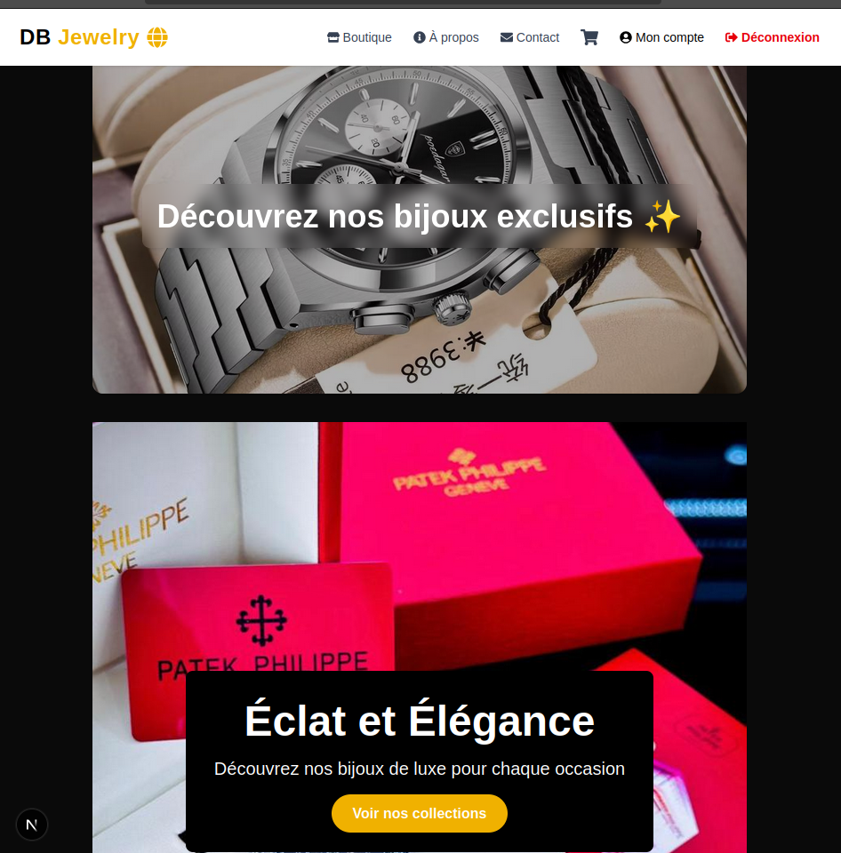
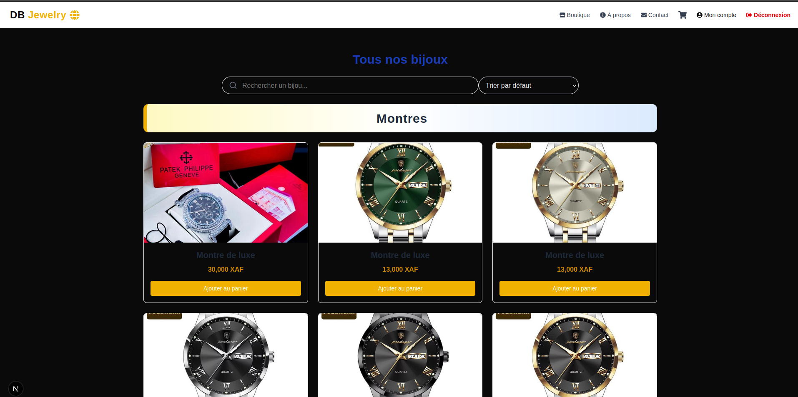
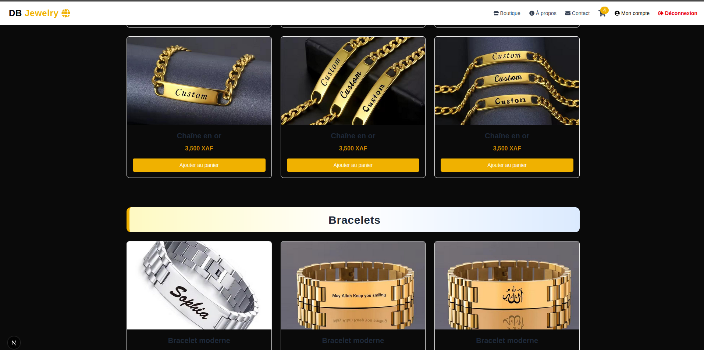
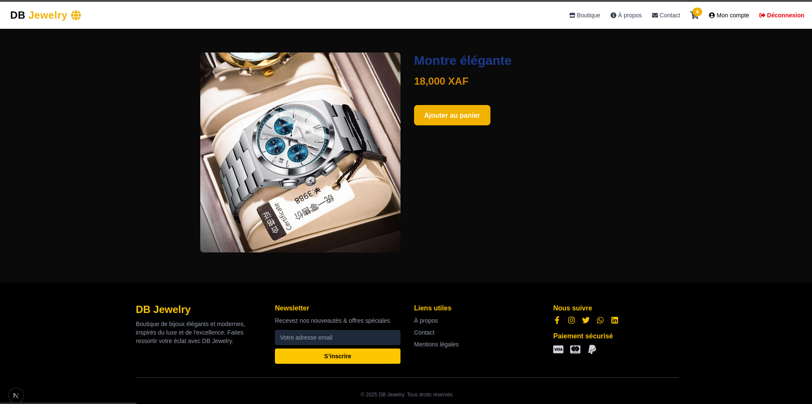
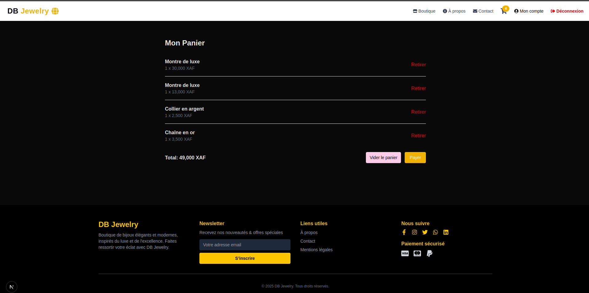
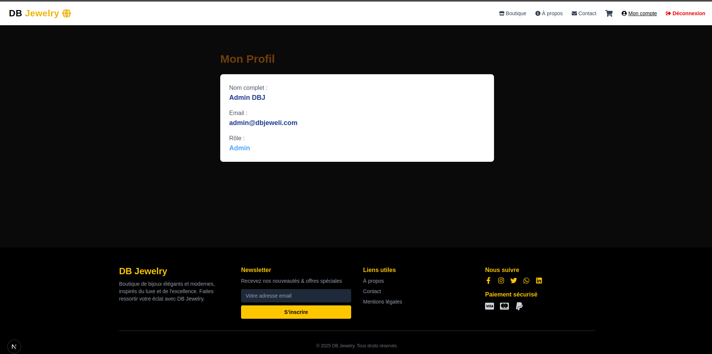
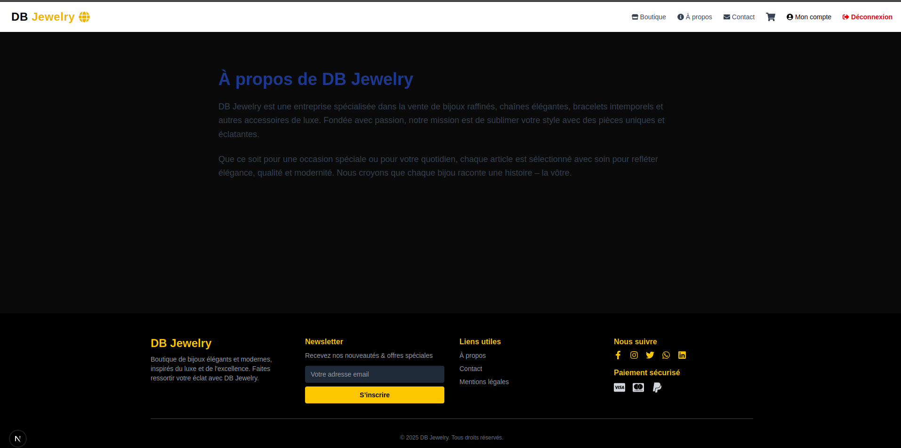
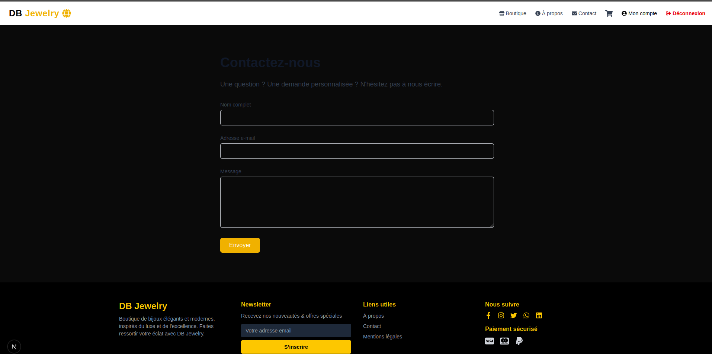

# 💎 DB Jewelry - Boutique en Ligne de Bijoux de Luxe

Bienvenue dans **DB Jewelry**, une application web moderne et élégante pour la vente de bijoux raffinés. Ce projet a été conçu pour offrir une expérience utilisateur fluide, intuitive et visuellement attrayante. Il intègre une navigation par catégories, un panier d’achat dynamique, des animations modernes et une interface responsive.

## 📋 Table des Matières
- [Captures d'Écran](#-captures-décran)
- [Fonctionnalités](#-fonctionnalités)
- [Technologies Utilisées](#-technologies-utilisées)
- [Installation et Lancement du Projet](#-installation-et-lancement-du-projet)
- [Structure du Projet](#-structure-du-projet)
- [Auteur](#-auteur)
- [Licence](#-licence)
- [Contribuer](#-contribuer)

## 📸 Captures d'Écran

### 🏠 Page d'Accueil


### 🛍️ Catalogue de Produits




### 📦 Détail d'un Produit


### 🛒 Panier


### Compte


### À Propos


### Contact


## 🚀 Fonctionnalités

- [x] Navigation claire par catégories
- [x] Recherche dynamique de produits
- [x] Ajout et suppression de produits dans le panier
- [x] Effets de survol et animations fluides
- [x] Bannière dynamique avec changement automatique d’image
- [x] Interface responsive (mobile / tablette / desktop)
- [x] Gestion du panier via contexte React
- [ ] Intégration du paiement (à venir)
- [ ] Authentification utilisateur (à venir)

## ⚙️ Technologies Utilisées

- **Next.js** 15+ - Framework React pour le rendu côté serveur
- **React** 18+ - Bibliothèque JavaScript pour l'interface utilisateur
- **Tailwind CSS** - Pour un design moderne et responsive
- **Context API** - Gestion du panier
- **JavaScript (ES6+)** - Programmation côté client
- **CSS Modules / Tailwind** - Styles modulaires et utilitaires
- **Flexbox / Grid** - Mise en page moderne

## 🛠️ Installation et Lancement du Projet

```bash
# 1. Cloner le dépôt
git clone https://github.com/Delmat237/db-jewelry-frontend.git
cd db-jewelry-frontend

# 2. Installer les dépendances
npm install

# 3. Lancer l'application en développement
npm run dev

# 4. Accéder à l'application
http://localhost:3000
```

## 📂 Structure du Projet

```
.
├── components/           # Composants réutilisables (HeroSection, ProductShowcase, etc.)
├── context/              # Contexte React pour le panier
├── data/                 # Données produits simulées
├── pages/                # Pages principales (accueil, produits, etc.)
├── public/images/        # Images utilisées (produits, bannières)
├── styles/               # Fichiers CSS globaux
├── README.md             # Ce fichier
```

## 👤 Auteur

**Leonel Azangue**  
- **Email** : [azangueleonel9@gmail.com](mailto:azangueleonel9@gmail.com)  
- **GitHub** : [@Delmat237](https://github.com/Delmat237)  
- **LinkedIn** : [leonel-azangue](https://www.linkedin.com/in/leonel-azangue)  
- **WhatsApp** : [+237 657 450 314](tel:+237657450314)

## 📄 Licence

Ce projet est sous licence MIT — voir le fichier [LICENSE](LICENSE) pour plus de détails.

## 🤝 Contribuer

Les contributions sont les bienvenues !  
N'hésitez pas à forker le dépôt, créer une branche, proposer une fonctionnalité ou corriger un bug via une Pull Request.

---

🌟 **Ajoutez une étoile à ce dépôt si vous aimez le projet !**
